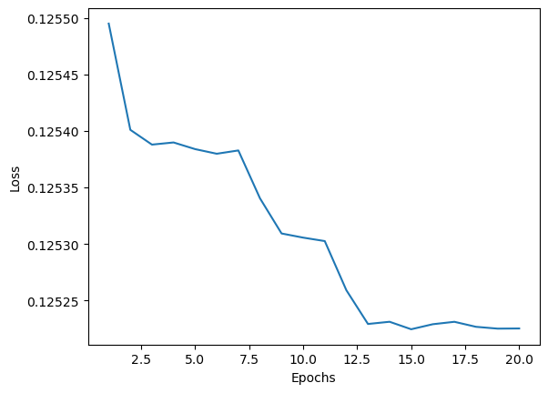
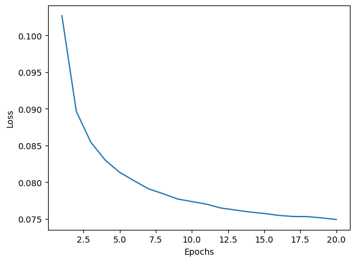
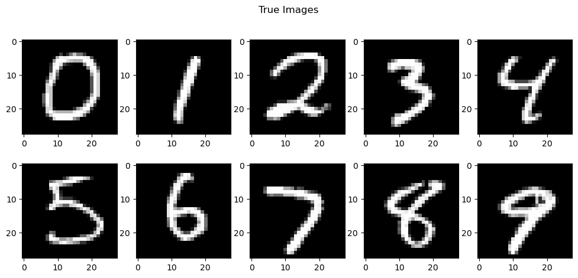
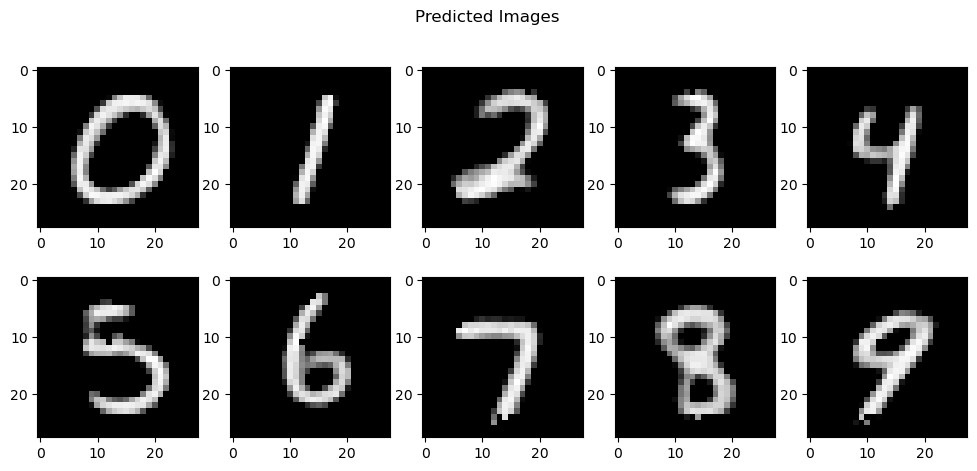

# Autoencoders

## Overview

Autoencoders are a type of neural networks used in representational learning to encode/compress data into a compact format, which can later be decoded to obtain the original data. They are the deep learning counterparts of the dimensionality reduction technique used in machine learning. An autoencoder basically tries to learn the identity function i.e, it tries to learn to output the input data. In practice, they learn efficient ways to represent data. An auto encoder has the following structure:

The encoder part of the networl takes data from the input space and maps/encodes it into a latent space of lower dimensionality. The decoder achieves the reverse process; recovering the original data from the latent space onto the output space. As expected, the number of neurons in the input and the output layers is the same. The latent layer is also referred to as the bottleneck layer.

## MNIST dataset

The MNIST database (Modified National Institute of Standards and Technology database) is a large collection of handwritten digits. It has a training set of 60,000 examples, and a test set of 10,000 examples. It is a subset of a larger NIST Special Database 3 (digits written by employees of the United States Census Bureau) and Special Database 1 (digits written by high school students) which contain monochrome images of handwritten digits. The digits have been size-normalized and centered in a fixed-size image. The original black and white (bilevel) images from NIST were size normalized to fit in a 20x20 pixel box while preserving their aspect ratio. The resulting images contain grey levels as a result of the anti-aliasing technique used by the normalization algorithm. the images were centered in a 28x28 image by computing the center of mass of the pixels, and translating the image so as to position this point at the center of the 28x28 field.

## MNIST Autoencoder

Due to the large dimensionality of the data, the autoencoder for MNIST is constructed as a stacked autoencoder with multiple layers in both encoder and decoder part. The general architecture for a deep autoencoder, or a stacked autoencoder is as follows:

The autoender used in this model has one input layer of 784 neurons which takes in the flattened image, three layers for the encoder(512, 256 and 128 neurons respectively), one latent layer of 11 neurons, and four layers for the decoder network(128, 256, 512 and 784 neurons respectively). Finally the 784 element vector is reshaped to an image of size (28x28), to compare with the input image. The autoencoder has been implemented using TensorFlow.

## Data preprocessing

Before feeding into the model, the data is normalized by dividing the intensity of each pixel by the maximum value of 255. Hence, the pixels which earlier had intensities varying between 0 and 255, will now have intensities varying between 0 and 1.

## Model training

The model was trained for 20 epochs using Adam optimizer with learning rate of 0.001. The objective function used is L1 norm(Mean absolute error). 

## Training results

With the above mentioned set of hyperparameters the loss function tends to initially reduce but becomes stagnant, and fails to converge. Increasing or decreasing the learning rate does not help improve the results.

## Solution: Dropouts

When dropouts are used in each layer, with a rate of 20%(along with the initial set of hyperparameters) the loss converges and the model successfully trains to encode and decode the data. At the end of training, the loss reduces to   from   . The performance on the testing data is very close to that on the training data, thus indicating that the model is generalizing on new data.

The following shows the performance of the model on the test data:

Thus the model successfully learned to encode the MNIST images into a 11x1 vector with high levels of acccuracy.

## References

[1] [TensorFlow Documentation](https://www.tensorflow.org/tutorials/generative/autoencoder)
[2] [Making an Autoencoder - Towards Data Science](https://towardsdatascience.com/how-to-make-an-autoencoder-2f2d99cd5103)
